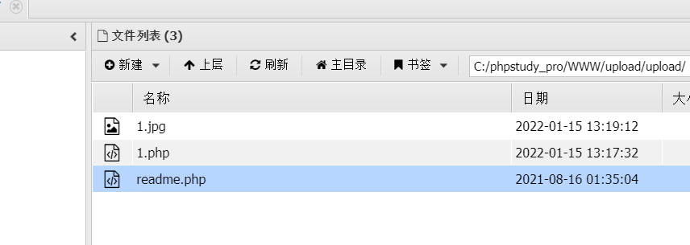
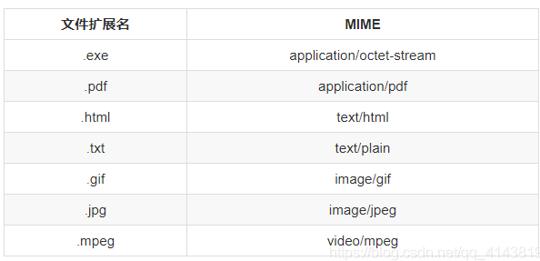
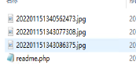
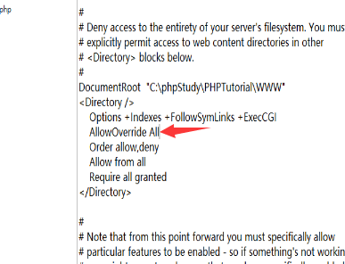

# 文件上传

[toc]


## 目录

### 简单

-   [极客大挑战 2019]Upload 基础的文件上传，php5环境可以利用script绕过标签限制
-   [ACTF2020 新生赛]Upload 基础的文件上传
-   [MRCTF2020]你传你🐎呢 基础的文件上传绕过
-   [GXYCTF2019]BabyUpload 基础的文件上传绕过

### 签到

-   [WUSTCTF2020]CV Maker
-   [RoarCTF 2019]Simple Upload
-   [HarekazeCTF2019]Avatar Uploader 2

### 中等

-   [SUCTF 2019]CheckIn .user.ini 除此之外还需要尝试绕过函数check
-   [XNUCA2019Qualifier]EasyPHP
-   [SWPU2019]Web3 jwt伪造+zip下载
-   [FireshellCTF2020]ScreenShoot
-   [JMCTF 2021]GoOSS 盲注解法很有意思=。=！

### 困难

-   2019 0CTF/TCTF wallbreaker easy 恶意so文件上传
-   [QWB2021 Quals]托纳多
-   l33t-hoster
-   [BBCTF2020]imgaccess2


## Upload labs

### lab1

前端绕过

```php
function checkFile() {
    var file = document.getElementsByName('upload_file')[0].value;
    if (file == null || file == "") {
        alert("请选择要上传的文件!");
        return false;
    }
    //定义允许上传的文件类型
    var allow_ext = ".jpg|.png|.gif";
    //提取上传文件的类型
    var ext_name = file.substring(file.lastIndexOf("."));
    //判断上传文件类型是否允许上传
    if (allow_ext.indexOf(ext_name + "|") == -1) {
        var errMsg = "该文件不允许上传，请上传" + allow_ext + "类型的文件,当前文件类型为：" + ext_name;
        alert(errMsg);
        return false;
    }
}

```

抓包改后缀为php，上传成功，




### lab2

```php
$is_upload = false;
$msg = null;
if (isset($_POST['submit'])) {
    if (file_exists(UPLOAD_PATH)) {
        if (($_FILES['upload_file']['type'] == 'image/jpeg') || ($_FILES['upload_file']['type'] == 'image/png') || ($_FILES['upload_file']['type'] == 'image/gif')) {
            $temp_file = $_FILES['upload_file']['tmp_name'];
            $img_path = UPLOAD_PATH . '/' . $_FILES['upload_file']['name']            
            if (move_uploaded_file($temp_file, $img_path)) {
                $is_upload = true;
            } else {
                $msg = '上传出错！';
            }
        } else {
            $msg = '文件类型不正确，请重新上传！';
        }
    } else {
        $msg = UPLOAD_PATH.'文件夹不存在,请手工创建！';
    }
}

```

修改MIME

，常见mime类型：



### lab3


```php
$is_upload = false;
$msg = null;
if (isset($_POST['submit'])) {
    if (file_exists(UPLOAD_PATH)) {
        $deny_ext = array('.asp','.aspx','.php','.jsp');
        $file_name = trim($_FILES['upload_file']['name']);
        $file_name = deldot($file_name);//删除文件名末尾的点
        $file_ext = strrchr($file_name, '.');
        $file_ext = strtolower($file_ext); //转换为小写
        $file_ext = str_ireplace('::$DATA', '', $file_ext);//去除字符串::$DATA
        $file_ext = trim($file_ext); //收尾去空

        if(!in_array($file_ext, $deny_ext)) {
            $temp_file = $_FILES['upload_file']['tmp_name'];
            $img_path = UPLOAD_PATH.'/'.date("YmdHis").rand(1000,9999).$file_ext;            
            if (move_uploaded_file($temp_file,$img_path)) {
                 $is_upload = true;
            } else {
                $msg = '上传出错！';
            }
        } else {
            $msg = '不允许上传.asp,.aspx,.php,.jsp后缀文件！';
        }
    } else {
        $msg = UPLOAD_PATH . '文件夹不存在,请手工创建！';
    }
}

```

黑名单：('.asp','.aspx','.php','.jsp');

>   trim()的作用是去掉字符串两端的多余的空格,注意,是两端的空格,且无论两端的空格有多少个都会去掉
>
>   strrchr() 函数查找字符串在另一个字符串中最后一次出现的位置，并返回从该位置到字符串结尾的所有字符。

可以看到每次上传的名称都不一样




黑名单绕过，后缀为php3,php5等

需要在配置文件中：

```
AddType application/x-http-php .php .php3 .php5 .phtml
```


### lab4

**(php5.4.45及以前版本有效,nts版无效)**

几乎过滤了所有有问题的后缀名


```php
$is_upload = false;
$msg = null;
if (isset($_POST['submit'])) {
    if (file_exists(UPLOAD_PATH)) {
        $deny_ext = array(".php",".php5",".php4",".php3",".php2",".php1",".html",".htm",".phtml",".pht",".pHp",".pHp5",".pHp4",".pHp3",".pHp2",".pHp1",".Html",".Htm",".pHtml",".jsp",".jspa",".jspx",".jsw",".jsv",".jspf",".jtml",".jSp",".jSpx",".jSpa",".jSw",".jSv",".jSpf",".jHtml",".asp",".aspx",".asa",".asax",".ascx",".ashx",".asmx",".cer",".aSp",".aSpx",".aSa",".aSax",".aScx",".aShx",".aSmx",".cEr",".sWf",".swf",".ini");
        $file_name = trim($_FILES['upload_file']['name']);
        $file_name = deldot($file_name);//删除文件名末尾的点
        $file_ext = strrchr($file_name, '.');
        $file_ext = strtolower($file_ext); //转换为小写
        $file_ext = str_ireplace('::$DATA', '', $file_ext);//去除字符串::$DATA
        $file_ext = trim($file_ext); //收尾去空

        if (!in_array($file_ext, $deny_ext)) {
            $temp_file = $_FILES['upload_file']['tmp_name'];
            $img_path = UPLOAD_PATH.'/'.$file_name;
            if (move_uploaded_file($temp_file, $img_path)) {
                $is_upload = true;
            } else {
                $msg = '上传出错！';
            }
        } else {
            $msg = '此文件不允许上传!';
        }
    } else {
        $msg = UPLOAD_PATH . '文件夹不存在,请手工创建！';
    }
}
```

上传一个.htaccess

```
SetHandler application/x-httpd-php
```

不成功修改



为none

这样所有文件都会解析为php，然后再上传图片马，就可以解析

或者上传固定名称：

```
<FilesMatch "1.jpg"
SetHandler application/x-httpd-php
</FilesMatch>
```

### lab5

黑名单里有htaccess，没有.php7` 以及 `.ini

>   　 user.ini ： 自 PHP 5.3.0 起，PHP 支持基于每个目录的 .htaccess 风格的 INI 文件。此类文件仅被
>      CGI／FastCGI SAPI 处理。此功能使得 PECL 的 htscanner 扩展作废。如果使用 Apache，则用
>      .htaccess 文件有同样效果。
>
>      除了主 php.ini 之外，PHP 还会在每个目录下扫描 INI 文件，从被执行的 PHP 文件所在目录开始一直上升到 web
>      根目录（$_SERVER['DOCUMENT_ROOT'] 所指定的）。如果被执行的 PHP 文件在 web 根目录之外，则只扫描该目录。
>
>      在 .user.ini 风格的 INI 文件中只有具有 PHP_INI_PERDIR 和 PHP_INI_USER 模式的 INI
>      设置可被识别。
>
>      两个新的 INI 指令，user_ini.filename 和 user_ini.cache_ttl 控制着用户 INI 文件的使用。
>
>      user_ini.filename 设定了 PHP 会在每个目录下搜寻的文件名；如果设定为空字符串则 PHP 不会搜寻。默认值是
>      .user.ini。
>
>      user_ini.cache_ttl 控制着重新读取用户 INI 文件的间隔时间。默认是 300 秒（5 分钟）。

上传.user.ini

`auto_prepend_file=wait5min.gif`

再上传wait5min.gif为马


等待5分钟后访问：`readme.php`

此时 `.user.ini` 指定的所有符合 php 语言格式的文件均会被 readme.php 执行

### lab6


黑名单里有htaccess，大写绕过，phP，只不过我没成功

也可以（黑名单验证，.user.ini.）

先上传一个以auto_prepend_file=1.gif为内容的.user.ini文件，然后再上传一个内容为php的一句话的脚本，命名为1.gif，.user.ini文件里的意思是：所有的php文件都自动包含1.gif文件。.user.ini相当于一个用户自定义的php.ini。


